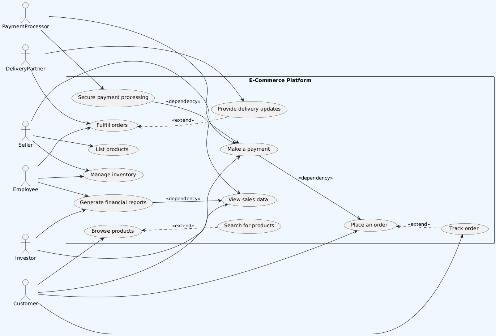

# Software Requirement Specification (SRS) for E-commerce Website

## Functional Requirements

### 1. Registration and Authentication (Buyers and Sellers)
- **FR1.1**: The system must allow user account creation with a secure password for buyers and sellers.
- **FR1.2**: The system must authenticate users via email/phone and password or third-party login (SSO).
- **FR1.3**: Sellers must provide necessary business information during registration (e.g., business name, address, bank details).
- **FR1.4**: The system must provide a mechanism for password recovery through email or SMS.

### 2. Search and Browse (Buyers)
- **FR2.1**: The system must allow product searches by keyword, category, or brand for buyers.
- **FR2.2**: The system must support filters such as price range, rating, and stock status.


### 3. Product Listing and Inventory Management (Sellers,employees)
- **FR3.1**: Sellers must be able to create new product listings with details such as images, price, and description.
- **FR3.2**: The system must allow sellers to edit and delete product listings.
- **FR3.3**: The system must allow sellers,employees to update inventory levels and track low-stock alerts.

### 4. Product Management (Buyers)
- **FR4.1**: The system must display product details including name, price, description, images, reviews, and specifications.
- **FR4.2**: Buyers must be able to submit and view reviews and ratings.
- **FR4.3**: The system must display real-time stock availability for each product.

### 5. Shopping Cart and Checkout (Buyers)
- **FR5.1**: The system must allow buyers to add, remove, and modify product quantities in the shopping cart.
- **FR5.2**: The system must allow buyers to complete a multi-step secure checkout process.
- **FR5.3**: The system must support guest checkout without account registration.

### 6. Payment and Transaction Processing (Buyers and Sellers)
- **FR6.1**: The system must support multiple payment methods (credit/debit cards, e-wallets, COD) for buyers.
- **FR6.2**: The system must securely process payments using a payment gateway.
- **FR6.3**: Sellers must be able to receive payments and view transaction history.

### 7. Order Tracking and Fulfillment (Buyers,Employee and Sellers)
- **FR7.1**: Buyers must be able to view their order history and track current order status.
- **FR7.2**: Sellers,employees must be able to manage and fulfill orders, including updating shipment status and tracking.
- **FR7.3**: The system must allow sellers,employees to handle returns, refunds, and order cancellations.

### 8. Sales Reporting and Analytics (Sellers,investor)
- **FR8.1**: The system must provide sellers with access to sales reports and analytics.
- **FR8.2**: Sellers must be able to view performance metrics (e.g., best-selling products, total revenue).

### 9. Notifications (Buyers,investor and Sellers)
- **FR9.1**: The system must send email or SMS notifications to buyers regarding order updates.
- **FR9.2**: The system must send notifications to sellers for new orders, payment status, and inventory alerts.

### 10. Customer Support (Buyers and Sellers)
- **FR10.1**: The system must provide customer support access via email, phone, or live chat for both buyers and sellers.
- **FR10.2**: The system must handle product return requests, disputes, and resolution for both buyers and sellers.

## Non-Functional Requirements (NFR)

### 1. Performance
- **NFR1.1**: The system should load pages and respond to user actions (search, browse, checkout) within 2 seconds.
- **NFR1.2**: The system should be able to handle high traffic volumes, especially during peak times (e.g., Black Friday sales).

### 2. Security
- **NFR2.1**: The system must ensure secure data transmission by using HTTPS and SSL encryption.
- **NFR2.2**: The system must comply with PCI-DSS standards for processing payments.
- **NFR2.3**: The system must provide optional two-factor authentication (2FA) for user accounts.

### 3. Usability
- **NFR3.1**: The system must provide a responsive design for all devices (mobile, tablet, desktop).
- **NFR3.2**: The system must comply with Web Content Accessibility Guidelines (WCAG) to ensure accessibility for users with disabilities.

### 4. Reliability
- **NFR4.1**: The system must maintain 99.9% uptime to ensure continuous availability for users.
- **NFR4.2**: The system must implement a disaster recovery process with regular data backups.

### 5. Scalability
- **NFR5.1**: The system must be able to scale to handle increased traffic and transaction loads without degradation in performance.

### 6. Compatibility
- **NFR6.1**: The system must be compatible with all major web browsers (Chrome, Firefox, Safari, Edge).
- **NFR6.2**: The system must integrate with third-party services (e.g., payment gateways, logistics) via APIs.

### 7. Maintainability
- **NFR7.1**: The system must be easy to update and maintain, with modular and documented code to facilitate future enhancements.

## UseCase Diagram



### Plant UML Code
```
@startuml
left to right direction
skinparam backgroundColor #f0f8ff
skinparam usecase {
    BackgroundColor<<Main>> #FFCCCC
    BackgroundColor<<Dependent>> #FFEECC
}

actor Customer
actor Seller
actor Employee
actor Investor
actor DeliveryPartner
actor PaymentProcessor

rectangle "E-Commerce Platform" {
    (Browse products) as BrowseProducts
    (Search for products) as SearchProducts
    (Place an order) as PlaceOrder
    (Make a payment) as MakePayment
    (Track order) as TrackOrder
    (View sales data) as ViewSalesData
    (List products) as ListProducts
    (Manage inventory) as ManageInventory
    (Fulfill orders) as FulfillOrders
    (Provide delivery updates) as DeliveryUpdates
    (Secure payment processing) as SecurePayments
    (Generate financial reports) as FinancialReports
}

' Relationships for Customers
Customer --> BrowseProducts
Customer --> PlaceOrder
Customer --> MakePayment
Customer --> TrackOrder

' Relationships for Sellers
Seller --> ListProducts
Seller --> ManageInventory
Seller --> ViewSalesData

' Relationships for Employees
Employee --> FulfillOrders
Employee --> ManageInventory
Employee --> FinancialReports

' Relationships for Delivery Partners
DeliveryPartner --> DeliveryUpdates
DeliveryPartner --> FulfillOrders

' Relationships for Payment Processors
PaymentProcessor --> SecurePayments
PaymentProcessor --> MakePayment

' Relationships for Investors
Investor --> FinancialReports
Investor --> ViewSalesData

' <<extend>> relationships
SearchProducts .u.> BrowseProducts : <<extend>>
TrackOrder .u.> PlaceOrder : <<extend>>
DeliveryUpdates .u.> FulfillOrders : <<extend>>

' <<dependency>> relationships
MakePayment --> PlaceOrder : <<dependency>>
SecurePayments --> MakePayment : <<dependency>>
FinancialReports --> ViewSalesData : <<dependency>>
@enduml
```


## GPT prompts used
- Improve the language and the flow of the document 
- Anything else that should be added 
- Improve the given uml code so that diagram becomes more readable